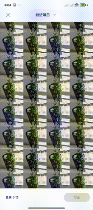

# RecyclerViewDragSelect




```java
DragSelectTouchHandler touchHandler = new DragSelectTouchHandler(recyclerview, new DragSelectListener() {
    @Override
    public boolean isSelected(int index) {
	return adapter.isSelected(index);
    }

    @Override
    public void onSetSelect(int start, int end, boolean select) {
	// update
    }
});
dragRV.addOnItemTouchListener(touchHandler);
```
